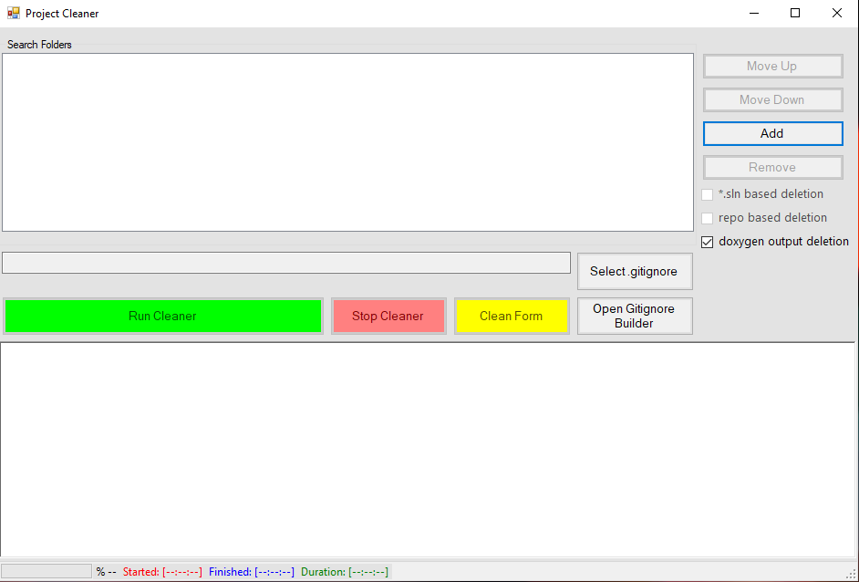
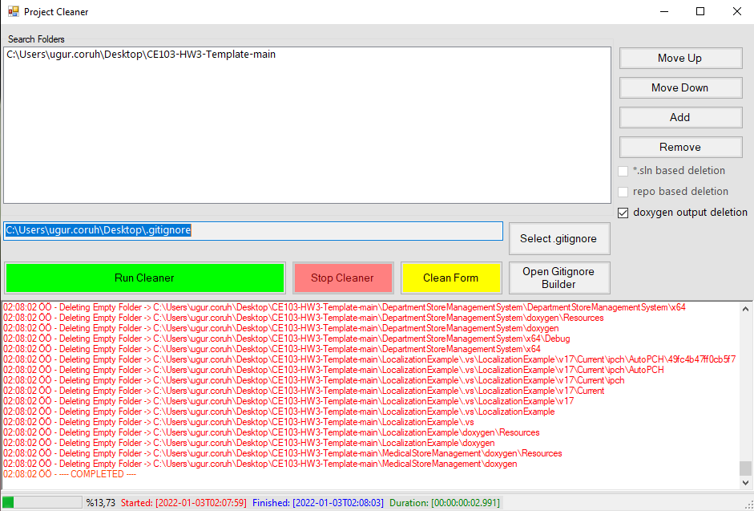
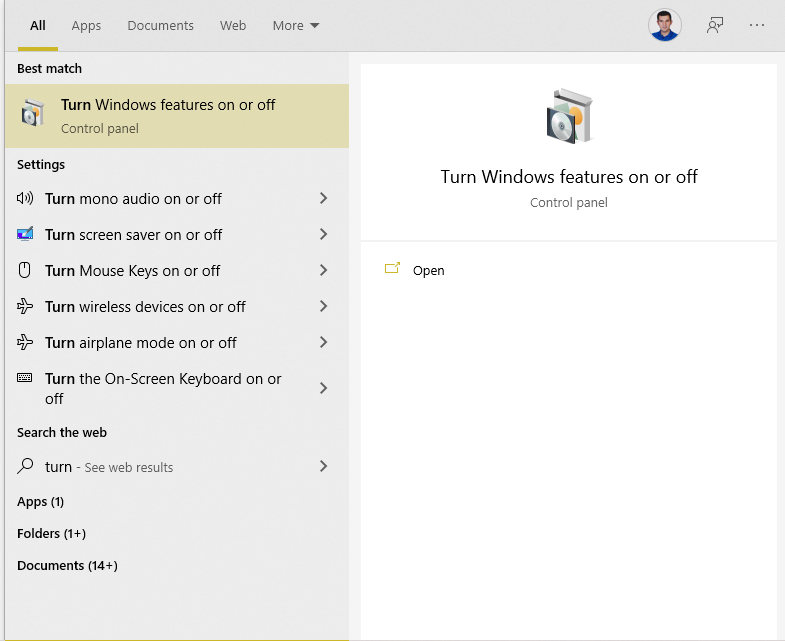
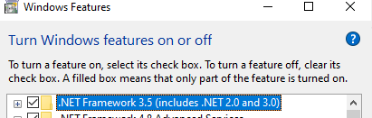

# Project Cleaner

# .gitignore based folder cleaner


## Usage



- If you have a .gitignore file, drag-drop it to textbox near select .gitignore and set your gitignore file. 

- If you do not have a .gitignore file, please use open gitignore builder and download content as file .gitignore. 

- Drag-drop your folders that contains projects

- Click Run Cleaner

- If you have Doxygen generated outputs to clean. A Doxygen configuration reader tries to find out the output folder and delete it. 

- You can stop with the stop cleaner button. 



## Development

### Visual Studio 2022 for Project Development

Install Visual Studio 2022

[Visual Studio 2022 Community Edition – Son Ücretsiz Sürümü İndir](https://visualstudio.microsoft.com/tr/vs/community/)

### Wix Toolkit for Setup Generation

**Step-1** Enable .Net 3.5.1 Components

Open Turn Windows Features On of Off Menu



Check .Net Framework 3.5 



Complete Setup

**Step-2** Download and  Install Wix Toolkit and Visual Studio 2022 Extension

[Downloads](https://wixtoolset.org/releases/)

**Step-3** After installation, if you have a reference problem, you need to configure DLLs from the path such as "WixUIExtension.dll."

```textile
C:\Program Files (x86)\WiX Toolset v3.11\bin
```

### References

**Git Auto Increment Tool**

[GitHub - jeromerg/NGitVersion: Automatic versioning of C# and C++ DLLs (CLI and Native) based on Git Repository information](https://github.com/jeromerg/NGitVersion)

**Advanced Wix Setup**

[Real-World Example: WiX/MSI Application Installer &bull; Helge Klein](https://helgeklein.com/blog/real-world-example-wix-msi-application-installer/)

**Wix Editor**

https://wixedit.github.io/

**Wix Standalone Setup Toolkit for Github Actions**

[GitHub - fbarresi/wix: wix standalone - checkout this repo to build wix project inside github action](https://github.com/fbarresi/wix)
